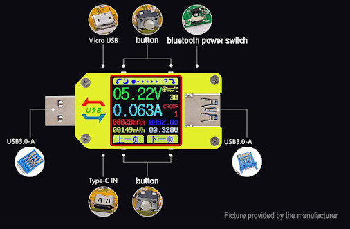

# Description
This project communicates with UM34C via bluetooth. It can store UM34C's data in CSV file.  
If bluetooth address of UM34C is not specified via command line this program checks for UM34C device and stores it's address in a `um34c_addr.txt` file for later usage (that next time you run the program there is no need to specify UM34C's address).  
It was tested on Ubuntu 18.04.  

# Install
1. Install bluetooth library:  
`sudo apt install libbluetooth-dev`
2. Install ncurses library:  
`sudo apt install libncurses5-dev`
3. Install make:  
`sudo apt install make`
4. Install gcc:
`sudo apt install gcc`
5. Open root folder of this project and build application:  
`make`

# Usage
* Stop running program by pressing: `CTRL+C` or `c`  
* Once build/compiled you can run:  
`build/main`  
* Specify UM34C's bluetooth address (there is actually no need for this, program can search for UM34C device and than store its address in `um34c_addr.txt` for later usage (next time you run the program)):  
`build/main -a 00:15:A3:00:2D:BF`  
* Specify interval in which data from UM34C is queried (in us) - default value is 500000us (500ms). This example sets it to 1000000us which is 1s:  
`build/main -i 1000000`  
* Start reading device on startup:  
`build/main -r`  
* Start reading device and saving data to CSV file on startup:  
`build/main -r -csv`  

## In application
* Exit application: `CTRL+C` or `c`
* Set device brightness: `UP`/`DOWN`
* Move to previous/next display: `LEFT`/`RIGHT`
* Toggle data sampling: `SPACE`
* Toggle saving to CSV file: `s`
* Rotate screen: `r`
* Set screen timeout: `0`-`9`

# Thanks
Thanks to 'sebastianha' which inspired this project. Here is [LINK](https://github.com/sebastianha/um34c) to his project.

# Suggestions
If you have any suggestions please let me know.

# License
Licensed under the GPLV3 License